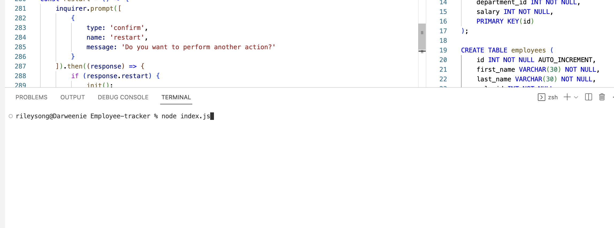

# Employee-Tracker

  ## Description
  This project was built to demonstrate my knowledge of manipulating relational databses using SQL in Node.js. This application allows the user to view and change three different tables in a database to keep track of their employees, their roles, salaries, managers and departments.

  ## Table of Contents
  [Description](#description)

  [Installation](#installation)

  [Usage](#usage)

  [Credits](#credits)

  [Testing](#testing)

  [License](#license)

  [Questions](#questions)

  ## Installation 
  Node.js

  ## Usage
  To use this application, users must open an integraed terminal in Node.js. Users can then type 'node index.js' in the terminal to initialize the app. Type each input and hit enter to move to the next prompt. 
  To open the terminal:
  

  To initialize the app:
  

  ## Credits
  N/A 

  ## Testing
  N/A

  ## License
  A short and simple permissive license with conditions only requiring preservation of copyright and license notices. Licensed works, modifications, and larger works may be distributed under different terms and without source code.
  [https://opensource.org/license/mit/](https://opensource.org/license/mit/)
  ## Questions
  Please reach out to rileysong01, at [https://github.com/rileysong01](https://github.com/rileysong01) or at rsong47@uwo.ca for additional questions. 